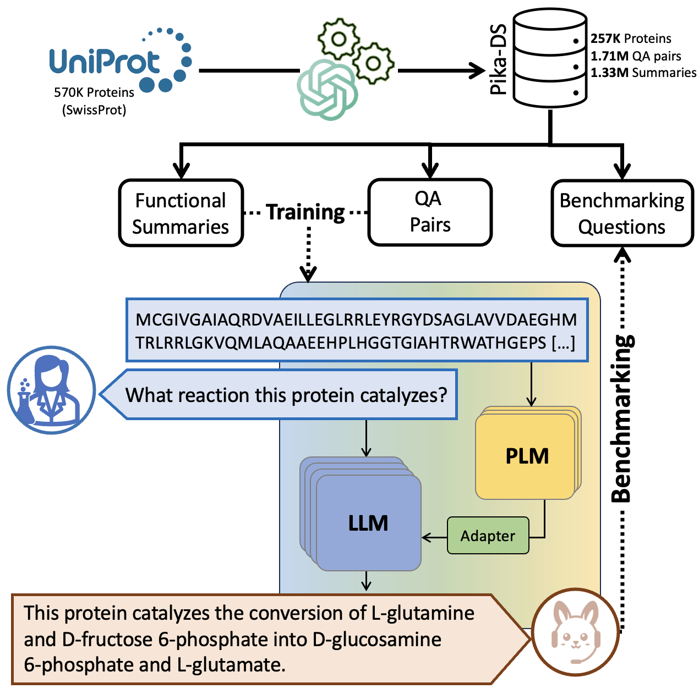

<h1 id="pika">Pika </h1>

Pika enables scientific question answering about protein sequences.

In [PQA: Zero-shot Protein Question Answering for Free-form Scientific Enquiry with Large Language Models](https://arxiv.org/pdf/2402.13653) we introduce the novel task of zero-shot Protein Question Answering (PQA) for free-form scientific enquiry. Given a previously unseen protein sequence and a natural language question, the task is to deliver a scientifically accurate answer. This task not only supports future biological research, but could also provide a test bed for assessing the scientific precision of large language models (LLMs). We contribute the first specialized dataset for PQA model training, containing 257K protein sequences annotated with 1.97M scientific question-answer pairs. Additionally, we propose and study several novel biologically relevant benchmarks for scientific PQA. Employing two robust multi-modal architectures, we establish an initial state-of-the-art performance for PQA and reveal key performance factors through ablation studies. Our comprehensive PQA framework, named Pika, including dataset, code, model checkpoints, and a user-friendly demo, is openly accessible, promoting wider research and application in the field.

<p align="left"></p>

## Installation guide

```bash
pip install git+https://github.com/EMCarrami/Pika.git
```

From source
```bash
yes | conda create --name pika python=3.10
conda activate pika
pip install -e .
```

For contribution please install in dev mode and use pre-commit
```bash
yes | conda create --name pika python=3.10
conda activate pika
pip install -e ".[dev]"
pre-commit install
```

## Usage

### Commandline

```bash
python run.py --config configs/train_config.json --run_mode train_and_benchmark
```

Nested keys can be parsed as below as long as all keys are present in the config
```bash
python run.py --config configs/train_config.json --run_mode train_and_benchmark --model.enable_gradient_checkpointing True
```

### Python

Please check [notebooks](https://github.com/EMCarrami/Pika/tree/main/notebooks) for examples.

For training followed by Biochem-ReAct benchmarking
```python
from pika.main import Pika
from pika.utils.helpers import load_config

config = load_config("path/to/config")
model = Pika(config)
model.train()
model.biochem_react_benchmark(model_to_use="best")
```

## Interactive Demo

Coming soon ...

## Dataset & Model Checkpoints

Both will be made available upon official publication of the work
