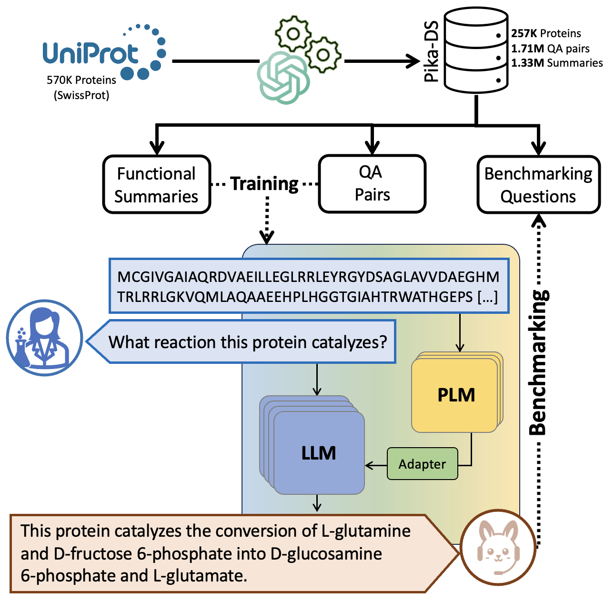

<table width="100%">
  <tr>
    <td style="font-size: 36px; font-weight: bold; width: 85%;">
      Pika
      <br>
      <!-- Smaller font size for the description -->
      <span style="font-size: 14px; font-weight: normal; display: block;">Pika enables scientific question answering about protein sequences.</span>
    </td>
    <td></td>
  </tr>
</table>


Preprint: [PQA: Zero-shot Protein Question Answering for Free-form Scientific Enquiry with Large Language Models](https://arxiv.org/submit/5421595/view)
<p align="left"></p>

## Installation from source

```bash
pip install pip install git+https://github.com/EMCarrami/Pika.git
```

From source
```bash
yes | conda create --name pika python=3.10
conda activate pika
pip install -e .
```

For contribution please install in dev mode and use pre-commit
```bash
yes | conda create --name pika python=3.10
conda activate pika
pip install -e ".[dev]"
pre-commit install
```

## Usage

### Commandline

```bash
python run.py --config configs/train_config.json --run_mode train_and_benchmark
```

Nested keys can be parsed as below as long as all keys are present in the config
```bash
python run.py --config configs/train_config.json --run_mode train_and_benchmark --model.enable_gradient_checkpointing True
```

### Python

Please check [notebooks](https://github.com/EMCarrami/Pika/tree/main/notebooks) for examples.

For training followed by Biochem-ReAct benchmarking
```python
from pika.main import Pika
from pika.utils.helpers import load_config

config = load_config("path/to/config")
model = Pika(config)
model.train()
model.biochem_react_benchmark(model_to_use="best")
```
